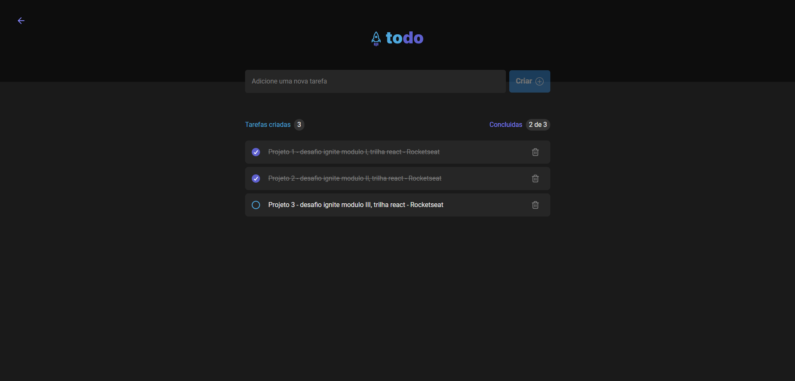

  <h1>
    Boas vindas ao projeto "ToDo List"!
  </h1>

  <a href="#tecnologias">Tecnologias</a>&nbsp;&nbsp; |&nbsp;&nbsp;
  <a href="#projeto">Projeto</a>&nbsp;&nbsp; |&nbsp;&nbsp;
  <a href="#instruções">Instruções</a>&nbsp;&nbsp; |&nbsp;&nbsp;
  <a href="#contato">Contato</a>

 
    

 

[**Interface - Site**](https://challenge-todolist.vercel.app/)

 

---

<h1 id="tecnologias">✨ Tecnologias ✅</h1>

 

Projeto realizado como desafio sugerido ao término do módulo 1 da trilha React no curso Ignite da [Rocketseat](https://www.rocketseat.com.br/) 🚀

Esse projeto foi desenvolvido com as seguintes tecnologias:

- React
- Vite
- TypeScript

 

---

<h1 id="projeto">💻 Projeto ✅</h1>

 

Este projeto de desafio é uma aplicação de controle de tarefas no estilo to-do list, que contém as seguintes funcionalidades:

- Adicionar uma nova tarefa

- Marcar e desmarcar uma tarefa como concluída

- Remover uma tarefa da listagem

- Mostrar o progresso de conclusão das tarefas

 

Sobre o desenvolvimento (conceitos e fundamentos):

- Estado

- LocalStorage

- Listas e chaves no ReactJS

- Propriedades

- Componentização

- Deploy na plataforma [Vercel](https://vercel.com/) sincronizado com GitHub.

- Estilização dos componentes utilizando a lib [styled components](https://styled-components.com/).

 

---

<h1 id="instruções"> 🚀 Instruções ✅</h1>

 

### Para instalação

1. Clone o repositório

- `git@github.com:amosrodrigues/challenge-todolist.git`.
  - Entre na pasta do repositório que você acabou de clonar:
  - `challenge-todolist`

2. Instale as dependências já contidas no arquivo `package.json`.

- `npm install`

3. Crie uma branch a partir da branch `main` conforme preferir.

4. Rode o senguinte comando para iniciar a aplicação: 🎲

- `npm run dev`

 

---

<h1 id="contato">📞 Contato ✅</h1>

 

<h1>
  
</h1>

 
  
   

 

👋🏻 Espero que tenha curtido! 💜 💚
